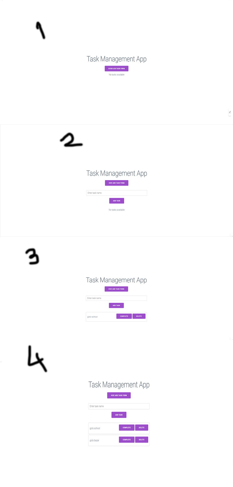

নতুন ফিচার এবং ডিজাইনের ভিত্তিতে আমি টাস্ক ম্যানেজমেন্ট অ্যাপের জন্য ব্লেড টেমপ্লেট তৈরি করছি। এটি প্রথমে কোন টাস্ক না থাকলে প্রথম ছবির মতো দেখাবে, তারপর বাটনে ক্লিক করলে ফর্মটি দেখাবে, টাস্ক যোগ করলে তালিকা দেখাবে, এবং "Complete" বাটনে ক্লিক করলে ঐ টাস্ক সবুজ হয়ে যাবে।


```php
<!DOCTYPE html>
<html lang="en">
<head>
    <meta charset="UTF-8">
    <meta name="viewport" content="width=device-width, initial-scale=1.0">
    <title>Task Management App</title>
    <style>
        body {
            font-family: Arial, sans-serif;
            text-align: center;
            margin: 0;
            padding: 20px;
            background-color: #f9f9f9;
        }
        .container {
            max-width: 500px;
            margin: 0 auto;
        }
        h1 {
            color: #5e35b1;
        }
        .btn {
            background-color: #7e57c2;
            color: white;
            border: none;
            padding: 10px 20px;
            margin: 10px 0;
            border-radius: 5px;
            cursor: pointer;
        }
        .btn:hover {
            background-color: #5e35b1;
        }
        .hidden {
            display: none;
        }
        ul {
            list-style-type: none;
            padding: 0;
        }
        li {
            display: flex;
            justify-content: space-between;
            align-items: center;
            background-color: white;
            padding: 10px;
            margin: 5px 0;
            border: 1px solid #ddd;
            border-radius: 5px;
        }
        li.completed {
            background-color: #d4edda;
            text-decoration: line-through;
        }
        .task-actions button {
            margin-left: 5px;
        }
    </style>
</head>
<body>
    <div class="container">
        <h1>Task Management App</h1>

        <!-- Button to Show/Hide Add Task Form -->
        <button class="btn" id="toggleFormButton">Show Add Task Form</button>

        <!-- Add Task Form -->
        <div id="addTaskForm" class="hidden">
            <form action="{{ route('tasks.store') }}" method="POST">
                @csrf
                <input type="text" name="title" placeholder="Enter task name" required>
                <button type="submit" class="btn">Add Task</button>
            </form>
        </div>

        <!-- Task List -->
        <h2>Tasks</h2>
        @if ($tasks->isEmpty())
            <p>No tasks available</p>
        @else
            <ul>
                @foreach ($tasks as $task)
                    <li class="{{ $task->is_completed ? 'completed' : '' }}">
                        {{ $task->title }}
                        <div class="task-actions">
                            <!-- Complete Button -->
                            <form action="{{ route('tasks.update', $task->id) }}" method="POST" style="display: inline;">
                                @csrf
                                @method('PUT')
                                <button type="submit" class="btn" style="background-color: #28a745;">Complete</button>
                            </form>
                            <!-- Delete Button -->
                            <form action="{{ route('tasks.destroy', $task->id) }}" method="POST" style="display: inline;">
                                @csrf
                                @method('DELETE')
                                <button type="submit" class="btn" style="background-color: #dc3545;">Delete</button>
                            </form>
                        </div>
                    </li>
                @endforeach
            </ul>
        @endif
    </div>

    <script>
        // Toggle Add Task Form
        const toggleFormButton = document.getElementById('toggleFormButton');
        const addTaskForm = document.getElementById('addTaskForm');

        toggleFormButton.addEventListener('click', () => {
            if (addTaskForm.classList.contains('hidden')) {
                addTaskForm.classList.remove('hidden');
                toggleFormButton.textContent = 'Hide Add Task Form';
            } else {
                addTaskForm.classList.add('hidden');
                toggleFormButton.textContent = 'Show Add Task Form';
            }
        });
    </script>
</body>
</html>
```

রাউট তৈরি

```php
use App\Models\Task;

Route::get('/welcome', function () {
    // ডাটাবেজ থেকে সমস্ত টাস্ক ফেচ করা
    $tasks = Task::all();

    // ভিউতে $tasks ভ্যারিয়েবল পাঠানো
    return view('index', compact('tasks'));
});
```
